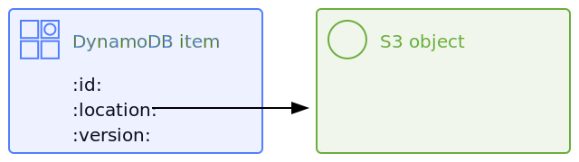

# terraform-aws-vhs

This module creates the persistent storage for a *Versioned Hybrid Store (VHS)*.

The VHS is a combination of a DynamoDB table and an S3 bucket.
When we store large values, we write:

*   The value as an object in S3, and
*   A pointer to the S3 object as an item in DynamoDB

This is a hybrid of two data stores, and the DynamoDB pointers record the version of the value -- thus, Versioned Hybrid Store.

This is [Amazon's recommended approach][aws_recommends] for storing large values in DynamoDB:

> If your application needs to store more data in an item than the DynamoDB size limit permits, you can try compressing one or more large attributes, or you can store them as an object in Amazon Simple Storage Service (Amazon S3) and store the Amazon S3 object identifier in your DynamoDB item.

This module creates the DynamoDB table and S3 bucket for this purpose.
It also creates some IAM policies that can be used to read or modify the VHS.

[aws_recommends]: https://docs.aws.amazon.com/amazondynamodb/latest/developerguide/bp-use-s3-too.html

## Possible alternatives

-   **Just DynamoDB?**
    Items in DynamoDB have a [maximum size of 400KB](https://docs.aws.amazon.com/amazondynamodb/latest/developerguide/Limits.html#limits-items), which is too small for our stores.

-   **Just DynamoDB, but with compressed items?**
    This only delays the issue -- we'd still hit the 400KB limit, but later.

-   **Just S3?**
    DynamoDB supports [conditional writes] to ensure updates are ordered correctly; S3 does not.
    We need correct ordering, so this is unsuitable for our stores.

-   **Another database technology?**
    Plenty of databases have larger per-item limits and conditional writes (e.g. Cassandra, MySQL, Aurora), but we were already using DynamoDB and S3.
    It's easier for us to use a few databases that we understand well than use a lot of databases we understand a little.

[conditional writes]: https://docs.aws.amazon.com/amazondynamodb/latest/developerguide/WorkingWithItems.html#WorkingWithItems.ConditionalUpdate

## Variants of VHS

There are two variants of the VHS:

*   The `single-version-store` tracks a single version of each value.
    The DynamoDB table only keeps the pointer to the newest object in S3.

    (The table has a hash key `id`.)

*   The `multi-version-store` tracks every version of a value.
    The DynamoDB table keeps the pointer to every object in S3.

    (The table has a hash key `id` and a range key `version`.)

## Client libraries

We have Scala classes for interacting with a VHS in our [shared Scala libraries][scala_libs].

[scala_libs]: https://github.com/wellcomecollection/scala-libs/tree/main/storage

## Further reading

-   [Creating a data store from S3 and DynamoDB][stacks]

[stacks]: https://stacks.wellcomecollection.org/creating-a-data-store-from-s3-and-dynamodb-8bb9ecce8fc1
